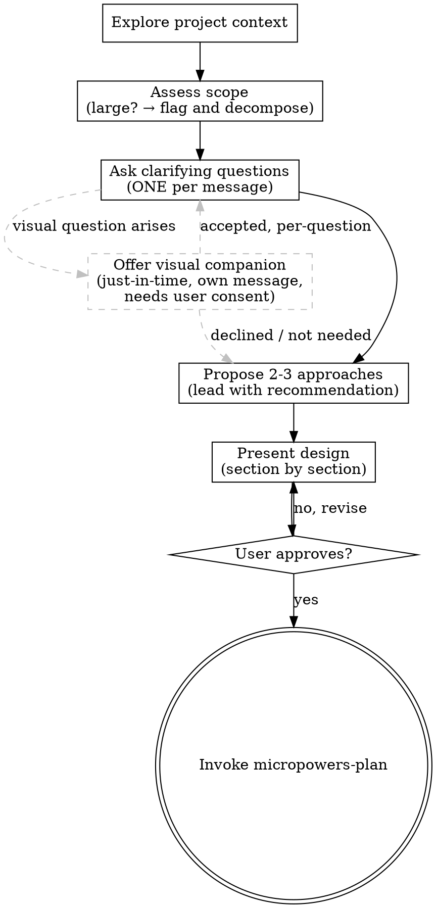

# Brainstorming (Micro)

Turn rough ideas into a clear, shared understanding through natural collaborative dialogue.

Start by understanding the current project context, then ask questions one at a time to refine the idea.  Once you understand what you're building, present the design and get approval.

<HARD-GATE>
1. Do NOT invoke any implementation skill, write any code, scaffold any project, or take any implementation action until you have presented a design and the user has approved it.  This applies to EVERY project regardless of perceived simplicity.
2. Before exploring project source code, you MUST activate the project's declared code-index tool.  Check the project's rules (AGENTS.md / CLAUDE.md / README / CONTRIBUTING) for a declared index/search tool (e.g. codegraph, ast-grep); if one is declared, find and activate it through your platform's tool-discovery mechanism (e.g. ToolSearch) if it isn't already listed, and use it for source exploration.  Do NOT explore source with grep / find / Glob while a declared index tool is available — those are fallbacks for config files, docs, and un-indexed files only.
</HARD-GATE>

## Anti-Pattern: "This Is Too Simple To Need A Design"

Every feature goes through this process.  A todo list, a single-function utility, a config change — all of them.  "Simple" tasks are where unexamined assumptions cause the most wasted work.  The design can be short (a few sentences for truly simple things), but you MUST present it and get approval.

If the task is genuinely trivial — a one-line config change, a typo fix, a copy edit — the design presentation can be one sentence.  But it still happens.  No exceptions.

## The Process

**The terminal state is invoking micropowers-plan.** Do NOT invoke micropowers-execute or any implementation skill directly.

## Checklist

You MUST complete these items in order:

1. **Explore project context** — check existing files, docs, recent commits, and conventions.  Know what you're building on top of.  Before touching source code, check the project's own rules (AGENTS.md / CLAUDE.md / README / CONTRIBUTING) for a declared code-index or search tool — if one is declared, use it for source exploration, not grep/find (see "Exploring with the Project's Code Index Tool" below).
2. **Assess scope** — before asking detailed questions, judge the size.  If the request describes multiple independent subsystems (e.g. "build a platform with chat, file storage, and analytics"), flag this immediately: identify the pieces, their relationships, and which one to tackle first.  Do not waste questions refining details of a project that needs decomposition.
3. **Ask clarifying questions** — ONE per message, no exceptions.  Understand purpose, constraints, and success criteria.  Prefer multiple-choice when possible, but open-ended is fine.  Cap at roughly 8 questions; stop earlier if the design is clear.
3.5. **[可选] Offer the visual companion just-in-time** — NOT upfront.  The first time a clarifying question would genuinely be clearer shown than described (a mockup / layout / diagram / side-by-side comparison, not merely a UI topic), ask the user in its own message whether to open the visual companion.  On approval, follow `visual-companion.md`.  On decline, stay text-only and never raise it again unless they do.  Never offer it before the conversation reaches a visual question.
4. **Propose 2–3 approaches** — with trade-offs and your recommendation.  Lead with your recommended option and explain why.  The extra option(s) exist to surface a genuine alternative; a forced third is noise.
5. **Present the design** — in sections, get approval after each section.  Cover: architecture, components, data flow, error handling, testing, and the performance/security constraints if the request touches them (see "Performance & Security Signals" below).  For simple features, one section is enough.  For features touching multiple files or introducing new concepts, break into parts and confirm each.
6. **Get explicit approval** — the user must say yes before you proceed.
7. **Invoke micropowers-plan** — transition to implementation planning.

## Exploring with the Project's Code Index Tool

Many projects declare a preferred code-index/search tool in their rules (AGENTS.md, CLAUDE.md, .cursorrules, README) — e.g. `codegraph_explore`, `ast-grep`, `ctags`, or a custom indexer.  When the project declares one:

- **Source-code questions go through the index tool first.**  grep / find / Glob are fallbacks for config files, docs, and anything the index doesn't cover — not the default for understanding code.
- **Activate the tool if it isn't visible.**  Index tools are often exposed through a dynamic mechanism (deferred loading, tool search, an explicit capability list) rather than listed up front.  If you don't see the tool in your available tools, find and activate it before exploring — don't silently fall back to grep.
- **Pass the preference to subagents.**  If you delegate exploration to a subagent (e.g. an Explore agent), name the project's index tool explicitly in the subagent prompt and tell it to activate the tool if missing.  Subagents default to grep/glob and won't pick up project conventions on their own.
- **Project rules win.**  If the project's rules are more specific (exact tool, exact usage flow), follow those over this section.

## Performance & Security Signals

Remind yourself whether this request touches performance or security.  If it does, state the relevant constraints in the design; if it doesn't, a one-line note is enough — don't manufacture concerns.

Likely to matter when the feature involves:
- **Scale & cost** — large data volumes, hot paths, per-item work in loops, unbounded accumulation, memory/disk/bandwidth limits, pagination
- **Concurrency & timing** — parallel execution, shared mutable state, async races, latency or timeout expectations
- **Trust boundary** — external input (files, URLs, API calls, user text), input validation, injection (SQL/command/XSS), path traversal, authN/authZ, secrets and sensitive data
- **Durability & side effects** — irreversible operations, data loss risk, write conflicts

When any apply, capture the constraint in the design (target, boundary, or "not a concern because …") so the plan can carry it into verification.  When none apply, state so in one line and move on.

## Understanding the Idea

**Scope first:** before diving into questions, assess whether this is one feature or multiple independent projects.  If it's the latter, flag it immediately — help the user decompose, then focus on the first piece.

**One question per message:** never combine multiple questions in the same message.  If a topic needs more exploration, break it into separate messages.  This keeps the dialogue focused and prevents the user from cherry-picking which question to answer.

**Existing codebases:** explore the current structure before proposing changes.  Follow existing patterns.  Where existing code has problems that affect the work (a file that's grown too large, unclear boundaries, tangled responsibilities), include targeted improvements as part of the design — the way a good developer improves code they're working in.  Do not propose unrelated refactoring.

**Design for isolation:** break the system into small, well-bounded units.  Each unit should have one clear purpose, communicate through defined interfaces, and be understood and tested independently.  Can someone understand what a unit does without reading its internals?  Can you change the internals without breaking consumers?  If not, the boundaries need work.

## Style Adaptation

Before presenting anything to the user (questions, proposals, design sections), check the currently loaded style overlay.

- If a style has been loaded (via the entry skill's `micropowers-styles/<name>.md` overlay), follow its micropowers-brainstorm rules.
- If no style has been loaded, default to standard.

The style overlay defines behavior in this phase. Quick reference:

| Phase moment | Fast | Standard | Explainable | Auditable |
|---|---|---|---|---|
| Clarifying questions | ~3 cap, only irreversible forks | One per message, ~8 cap, multiple-choice preferred | Same + attach reasoning to each option | Same as standard. **No cap** — follow every branch to the bottom. |
| Proposal presentation | One recommended approach + one-line reason | 2-3 approaches with trade-offs, lead with recommendation | Same + rejected approaches and why | Same + label each decision point (D1, D2...) |
| Design presentation | Merge with proposal, one message | Section by section, approve each | Same + design logic per section | Section by section, label decisions |

**Auditable — question no-cap rule:** When the active style is auditable, the ~8 question soft cap does not apply. Continue asking until every meaningful branch of the design tree has been explored and no new decision points remain.

For full details, refer to the loaded style overlay file.

## Key Principles

- **One question at a time** — never overwhelm with multiple questions in one message
- **Multiple choice preferred** — easier to answer than open-ended when possible
- **YAGNI ruthlessly** — remove unnecessary features from all designs
- **Explore alternatives** — always propose 2-3 approaches before settling
- **Incremental validation** — present design section by section, get approval before moving on
- **Be flexible** — go back and clarify when something doesn't make sense

## Visual Companion

An optional browser-based tool for showing mockups, diagrams, and visual option comparisons during brainstorming.  It is a tool, not a mode — available only when the user agrees.  Accepting it means it's *available* for questions that benefit from visual treatment; it does NOT mean every question goes through the browser.

**Offering the companion (just-in-time):** Do NOT offer it upfront.  Wait until a question would genuinely be clearer shown than told — a real mockup / layout / diagram question, not merely a UI topic.  The first time that happens, offer it then, as its own message:
> "This next part might be clearer if I show you — I can put together mockups, diagrams, and side-by-side comparisons in a browser tab. It's optional and can be token-intensive. Want me to open it?"

**This offer MUST be its own message.** Only the offer — no clarifying question, summary, or other content.  Wait for the user's response.  If they accept, follow `visual-companion.md` to start the server.  If they decline, continue text-only and don't offer again unless they raise it.

**Per-question decision:** Even after the user accepts, decide FOR EACH QUESTION whether to use the browser or the terminal.  The test: would the user understand this better by seeing it than reading it?  A question about a UI topic is not automatically a visual question — "what kind of wizard do you want?" is conceptual (terminal); "which of these wizard layouts looks better?" is visual (browser).  See `visual-companion.md` for the full operating guide and the per-question decision table.

## Design

This is a standalone skill — it does not wrap or extend any other brainstorming
implementation.

What's light: no spec file on disk, no always-on visual companion, no two-phase review gate.
What's NOT light: thinking depth, question quality, design rigor.

- **No spec document on disk.** The conversation is the spec.  Writing a file
  adds ceremony without adding clarity when the user just confirmed the design
  in the same chat.
- **Visual companion is optional, off by default.**  Brainstorming is about
  alignment, not diagrams — so the default flow stays text-only.  The visual
  companion is only offered just-in-time when a question would be clearer shown
  than told, and only after the user agrees.  No agreement, no companion; the
  tool complexity is never introduced unless the user opts in.  See
  `visual-companion.md`.
- **No question cap on complexity.**  ~8 questions is typical; go deeper if the
  feature demands it.  The cap is a soft guide, not a hard limit.

## Red Flags

These thoughts mean STOP — you're rationalizing:

| Thought | Reality |
|---------|---------|
| "This is too simple for a design" | Simple things hide assumptions.  Present anyway. |
| "Let me just scaffold first" | You're avoiding the hard part.  Align first. |
| "I already know what they want" | You don't.  Ask one question. |
| "They said 'quick'" | Quick alignment prevents slow rework. |
| "Let me ask everything at once" | One question per message.  Split them. |
| "1 approach is enough for this" | 2-3 approaches surface trade-offs.  Always explore alternatives. |
| "Let me open the visual companion now" | Only open it after the user agrees — and only ask just-in-time when a visual question arises, never upfront. |
