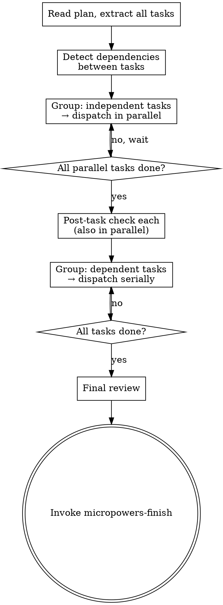

# Cluster Work

Execute the plan by dispatching subagents.  Independent tasks run in parallel
like a job cluster — serial only where one task produces files another consumes.

**Announce:** Announce what you're doing in the user's language (e.g. "用 micropowers-execute 并行执行计划").

## When to Use

- After `micropowers-plan` when user chose "Continue here" (option B)
- After `micropowers` detects a saved plan and user says "continue"

## The Process



## Step 1 — Detect Dependencies

Before dispatching anything, scan the plan's task list for dependencies.

A task **B depends on A** if B's `Files` field mentions modifying a file that
A's `Files` field creates.  When in doubt, assume dependency — serialize.

Example:
```
Task 1: Create `src/filters/useFilters.ts`
Task 2: Modify `src/filters/useFilters.ts` → depends on Task 1
Task 3: Modify `src/search/SearchBar.tsx` → independent of 1 and 2
Task 4: Create `src/search/__tests__/SearchBar.test.tsx` → independent
```

Result: [Task 1, Task 2] are a serial chain.  [Task 1, Task 3, Task 4] can
start in parallel.  Task 2 waits for Task 1.

## Step 2 — Dispatch Independent Tasks in Parallel

Tasks with no unmet dependencies are dispatched **simultaneously**.
Each gets a fresh subagent with:

```
## Task: [Task Name]

**Files:** [from plan]
**Change:** [from plan]

## Acceptance Criteria
[Copy the Verify checklist verbatim from the plan]

## Execution Discipline
1. Read the acceptance criteria above — these define "done"
2. Write tests that cover every acceptance criterion
3. Run your tests — confirm they FAIL before implementation
4. Implement the change
5. Run your tests — all MUST pass
6. Run the full project test suite — confirm NO regressions
7. Report: which tests you wrote, test results, any issues
```

**Isolation:** every subagent gets a clean context.  No conversation history.
The task spec IS the complete context.

**Parallel dispatch:** dispatch all independent tasks at once with
`run_in_background: true`.  Do NOT wait for each to finish before starting
the next — fire them all, then collect results.

## Style Adaptation

Progress reporting to the user varies by loaded style. The subagent dispatch template (Task spec + Acceptance Criteria + Execution Discipline) is **unchanged** — style only affects what the user sees.

If no style has been loaded, default to standard.

### During Step 3 (post-task check)

| Style | Progress report per task |
|---|---|
| Fast | ✅ task名  or  ❌ task名 — 一句话原因 |
| Standard | ✅ task名 — passed  or  ❌ task名 — 原因 |
| Explainable | Standard + failure includes root cause analysis |
| Auditable | Standard + every Verify item result (✅/❌ per line) |

### During Final Review

| Style | Report |
|---|---|
| Fast | 「全部通过」or 「N 个失败，详情见上」 |
| Standard | Summarize diff, test results, one line per issue |
| Explainable | Standard + implementation notes per task |
| Auditable | Standard + full Verify trace + decision point cross-references |

## Step 3 — Collect and Post-Task Check

As each parallel subagent finishes, run a 30-second sanity check.
These checks can also run in parallel for different tasks.

1. **Read the diff.**  Modified files not listed in the task?  Debug artifacts?
2. **Spot-check the Verify.**  Items 1 and the last one — do they pass?
3. **Decision:**
   - Both pass → task complete
   - Either fails → tell the subagent what's wrong, ONE retry.
     Retry still fails → note the issue, fix at the end.

## Step 4 — Dispatch Dependent Tasks Serially

Once all independent tasks pass their post-task checks, dispatch dependent
tasks one at a time in dependency order.  Same subagent template, same
post-task check, same retry rule.

## Final Review

After all tasks pass:

1. **Run the full test suite.**  Failures → identify which task, retry once.
2. **Diff review.**  Scan the combined diff for:
   - Unmodified files that were touched
   - Debug artifacts (console.log, print, TODO, FIXME)
   - Duplicated logic across tasks (two subagents solving the same problem)
   - Design-committed performance/security constraints: spot-check that tasks honored any constraints the brainstorm design declared
3. **If clean** → invoke `micropowers-finish`.
   **If issues** → fix the most impactful one, re-run tests, re-check.

## Design

- **Parallel by default, serial only on dependency.**  Tasks that don't share
  files run simultaneously.  Dependency detection is conservative — when in
  doubt, serialize.
- **Fresh context per subagent.**  No conversation history passed.  The task
  spec is the complete context — clean, focused, no noise.
- **TDD as execution discipline.**  Seven-step block embedded in every
  subagent prompt.  No separate TDD skill loaded.
- **Post-task check, not reviewer subagent.**  30-second sanity check by the
  coordinating agent.  One retry on failure.
- **Final review catches cross-task issues.**  Full test suite + diff scan.
